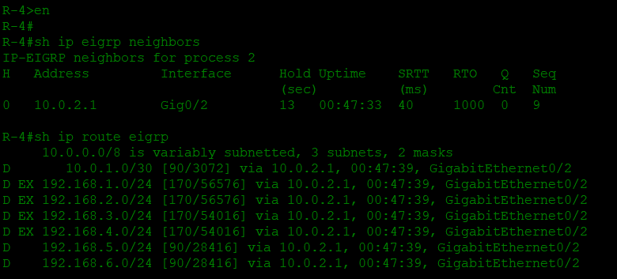

# CCNA Project: Dynamic Routing EIGRP

### 📝 **Project Description**
Implementation of the **dynamic routing protocol EIGRP** (Enhanced Interior Gateway Routing Protocol) on multiple Cisco routers to ensure fast, loop-free, and efficient exchange of routing information using DUAL (Diffusing Update Algorithm).

---

### 🖥️ **Topology**


---

### 🔧 **Device Summary**
| Device Type | Quantity | Role |
|-------------|----------|------|
| Router | 4 | Running EIGRP for dynamic routing |
| Switch | 8 | VLAN assignment & trunking |
| Access Point| 8 | Wireless distribution |
| PC | 6 | End devices |
| SmartPhone | 8 | End devices  |
| Laptop | 18 | End devices |

---

### 🌐 **IP Addressing & VLAN Plan**

| VLAN | Name | Network | Gateway (Router Subinterface) |
|------|------|---------|-------------------------------|
| 10 | IT | 192.168.1.0/24 | 192.168.1.254 |
| 20 | CS | 192.168.2.0/24 | 192.168.2.254 |
| 10 | Finance | 192.168.3.0/24 | 192.168.3.254 |
| 20 | Operations | 192.168.4.0/24 | 192.168.4.254 |
| 10 | Marketing | 192.168.5.0/24 | 192.168.5.254 |
| 20 | Sales | 192.168.6.0/24 | 192.168.6.254 |
| 10 | Logistics | 192.168.7.0/24 | 192.168.7.254 |
| 20 | Admin | 192.168.8.0/24 | 192.168.8.254 |

---

### ⚙️ **Technologies Used**
- EIGRP configuration  
- Autonomous System (AS) number  
- Neighbor adjacency verification  
- Fast convergence testing
- DCHP Server external

---

### 🚀 **Configuration Steps**

#### **1. Router Configuration (R1)**

```
enable
conf t

hostname R-1

interface GigabitEthernet0/0
 ip address 10.0.0.1 255.255.255.252
 no sh

interface Gig0/1
 no sh

interface GigabitEthernet0/1.10
 encapsulation dot1Q 10
 ip address 192.168.1.254 255.255.255.0
 ip helper-address 192.168.1.1

interface GigabitEthernet0/1.20
 encapsulation dot1Q 20
 ip address 192.168.2.254 255.255.255.0
 ip helper-address 192.168.1.1

router eigrp 1
 network 192.168.1.0
 network 192.168.2.0
 network 10.0.0.0

exit
```
#### **2. Router Configuration (R2)**

```
enable
conf t

hostname R-2

interface GigabitEthernet0/0
 ip address 10.0.0.2 255.255.255.252
 no sh

interface GigabitEthernet0/1
 ip address 10.0.1.1 255.255.255.252
 no sh

interface GigabitEthernet0/2
 no sh

interface GigabitEthernet0/2.10
 encapsulation dot1Q 10
 ip address 192.168.3.254 255.255.255.0
 ip helper-address 192.168.1.1

interface GigabitEthernet0/2.20
 encapsulation dot1Q 20
 ip address 192.168.4.254 255.255.255.0
 ip helper-address 192.168.1.1

router eigrp 1
 network 192.168.3.0
 network 192.168.4.0
 network 10.0.0.0

exit
```

#### **3. Router Configuration (R3)**

```
enable
conf t

hostname R-3

interface GigabitEthernet0/0
 no sh

interface GigabitEthernet0/0.10
 encapsulation dot1Q 10
 ip address 192.168.5.254 255.255.255.0
 ip helper-address 192.168.1.1

interface GigabitEthernet0/0.20
 encapsulation dot1Q 20
 ip address 192.168.6.254 255.255.255.0
 ip helper-address 192.168.1.1

interface GigabitEthernet0/1
 ip address 10.0.1.2 255.255.255.252
 no sh

interface GigabitEthernet0/2
 ip address 10.0.2.1 255.255.255.252
 no sh

router eigrp 1
 redistribute eigrp 2 
 network 10.0.0.0
 network 192.168.5.0
 network 192.168.6.0

router eigrp 2
 redistribute eigrp 1 
 network 10.0.0.0
 network 192.168.5.0
 network 192.168.6.0

exit
```

#### **4. Router Configuration (R4)**

```
enable
conf t

hostname R-4

interface GigabitEthernet0/0
 no sh

interface GigabitEthernet0/0.10
 encapsulation dot1Q 10
 ip address 192.168.7.254 255.255.255.0
 ip helper-address 192.168.1.1

interface GigabitEthernet0/0.20
 encapsulation dot1Q 20
 ip address 192.168.8.254 255.255.255.0
 ip helper-address 192.168.1.1

interface GigabitEthernet0/2
 ip address 10.0.2.2 255.255.255.252
 no sh

router eigrp 2
 network 192.168.7.0
 network 192.168.8.0
 network 10.0.0.0

exit
```

#### **5. Switch Configuration (SW1)**

```
enable
conf t

hostname SW-1

vlan 10
 name IT
vlan 20
 name CS

interface FastEthernet0/1
 switchport access vlan 10
 switchport mode access

interface FastEthernet0/2
 switchport access vlan 10
 switchport mode access

interface FastEthernet0/3
 switchport access vlan 10
 switchport mode access

interface FastEthernet0/4
 switchport access vlan 10
 switchport mode access

interface FastEthernet0/5
 switchport access vlan 10
 switchport mode access

interface FastEthernet0/6
 switchport access vlan 10
 switchport mode access

interface FastEthernet0/22
 switchport mode trunk
 channel-group 1 mode active

interface FastEthernet0/23
 switchport mode trunk
 channel-group 1 mode active

interface FastEthernet0/24
 switchport mode trunk

interface range fa0/7-21, Gig0/1-2
 sh

exit
```
#### **6. Switch Configuration (SW2)**

```
enable
conf t

hostname SW-2

vlan 10
 name IT
vlan 20
 name CS

interface FastEthernet0/1
 switchport access vlan 20
 switchport mode access

interface FastEthernet0/2
 switchport access vlan 20
 switchport mode access

interface FastEthernet0/3
 switchport access vlan 20
 switchport mode access

interface FastEthernet0/22
 switchport mode trunk
 channel-group 1 mode passive

interface FastEthernet0/23
 switchport mode trunk
 channel-group 1 mode passive

int ra fa0/4-21 , fa0/24, g0/1-2
 sh

exit
```
#### **7. Switch Configuration (SW3)**

```
enable
conf t

hostname SW-3

vlan 10
 name Finance
vlan 20
 name Operations

interface FastEthernet0/1
 switchport access vlan 10
 switchport mode access

interface FastEthernet0/2
 switchport access vlan 10
 switchport mode access

interface FastEthernet0/3
 switchport access vlan 10
 switchport mode access

interface FastEthernet0/22
 switchport mode trunk
 channel-group 1 mode active

interface FastEthernet0/23
 switchport mode trunk
 channel-group 1 mode active

interface FastEthernet0/24
 switchport mode trunk

int ra fa0/4-21, g0/1-2
 sh

exit
```
#### **8. Switch Configuration (SW4)**

```
enable
conf t

hostname SW-4

vlan 10
 name Finance
vlan 20
 name Operations

interface FastEthernet0/1
 switchport access vlan 20
 switchport mode access

interface FastEthernet0/2
 switchport access vlan 20
 switchport mode access

interface FastEthernet0/3
 switchport access vlan 20
 switchport mode access

interface FastEthernet0/22
 switchport mode trunk
 channel-group 1 mode passive

interface FastEthernet0/23
 switchport mode trunk
 channel-group 1 mode passive

int ra fa0/4-21, fa0/24, g0/1-2
 sh

exit
```

#### **9. Switch Configuration (SW5)**

```
enable
conf t

hostname SW-5

vlan 10
 name Marketing
vlan 20
 name Sales

interface FastEthernet0/1
 switchport access vlan 10
 switchport mode access

interface FastEthernet0/2
 switchport access vlan 10
 switchport mode access

interface FastEthernet0/3
 switchport access vlan 10
 switchport mode access

interface FastEthernet0/22
 switchport mode trunk
 channel-group 1 mode active

interface FastEthernet0/23
 switchport mode trunk
 channel-group 1 mode active

interface FastEthernet0/24
 switchport mode trunk

int ra fa0/4-21, g0/1-2
 sh

exit
```

#### **10. Switch Configuration (SW6)**

```
enable
conf t

hostname SW-6

vlan 10
 name Marketing
vlan 20
 name Sales

interface FastEthernet0/1
 switchport access vlan 20
 switchport mode access

interface FastEthernet0/2
 switchport access vlan 20
 switchport mode access

interface FastEthernet0/3
 switchport access vlan 20
 switchport mode access

interface FastEthernet0/22
 switchport mode trunk
 channel-group 1 mode passive

interface FastEthernet0/23
 switchport mode trunk
 channel-group 1 mode passive

int ra fa0/4-21, g0/1-2, fa0/24
 sh

exit
```

#### **11. Switch Configuration (SW7)**

```
enable
conf t

hostname SW-7

vlan 10
 name Logistics
vlan 20
 name Admin

interface FastEthernet0/1
 switchport access vlan 10
 switchport mode access

interface FastEthernet0/2
 switchport access vlan 10
 switchport mode access

interface FastEthernet0/3
 switchport access vlan 10
 switchport mode access

interface FastEthernet0/22
 switchport mode trunk
 channel-group 1 mode active

interface FastEthernet0/23
 switchport mode trunk
 channel-group 1 mode active

interface FastEthernet0/24
 switchport mode trunk

int ra fa0/4-21, g0/1-2
 sh

exit
```

#### **12. Switch Configuration (SW8)**

```
enable
conf t

hostname SW-7

vlan 10
 name Logistics
vlan 20
 name Admin

interface FastEthernet0/1
 switchport access vlan 20
 switchport mode access

interface FastEthernet0/2
 switchport access vlan 20
 switchport mode access

interface FastEthernet0/3
 switchport access vlan 20
 switchport mode access

interface FastEthernet0/22
 switchport mode trunk
 channel-group 1 mode passive

interface FastEthernet0/23
 switchport mode trunk
 channel-group 1 mode passive

int ra fa0/4-21, g0/1-2, fa0/24
 sh

exit
```

#### **13. DHCP Server Configuration**
- **IP Static**
  
<br>

- **Serverpool IT**  
  
<br>

- **Serverpool CS**
  
<br>

- **Serverpool Finance**
  
<br>

- **Serverpool Operations**
  
<br>

- **Serverpool Marketing**
  
<br>

- **Serverpool Sales**
  
<br>

- **Serverpool Logistics**
  
<br>

- **Serverpool Admin**
  

#### **14. Web Server Configuration**
- **IP Static**
  
<br>

- **Web Service**
  
<br>

#### **15. DNS Server Configuration**
- **IP Static**
  
<br>

- **DNS Service**
  
<br>

#### **16. Access Point Configuration**
- **AP IT**  
  
<br>

- **AP CS**
  
<br>

- **AP Finance**
  
<br>

- **AP Operations**
  
<br>

- **AP Marketing**
  
<br>

- **AP Sales**
  
<br>

- **AP Logistics**
  
<br>

- **AP Admin**
  

### ✅  **Testing Results**
- **IP Dynamic**
  
<br>

- **Web Service**
  
<br>

- **Ping End-to-End**
  
<br>

- **Check Routing**
  - Router 1
  
 <br>

  - Router 2
  
 <br>

  - Router 3
  
 <br>

  - Router 4
  
 <br>